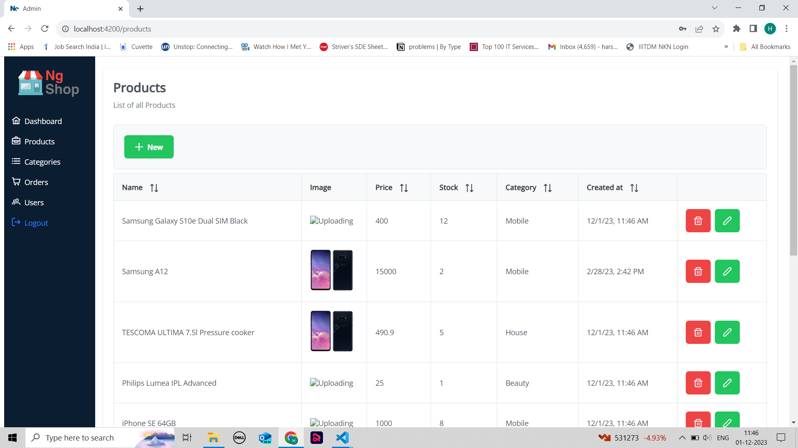
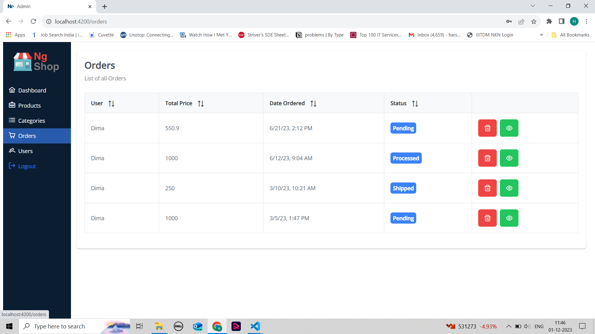
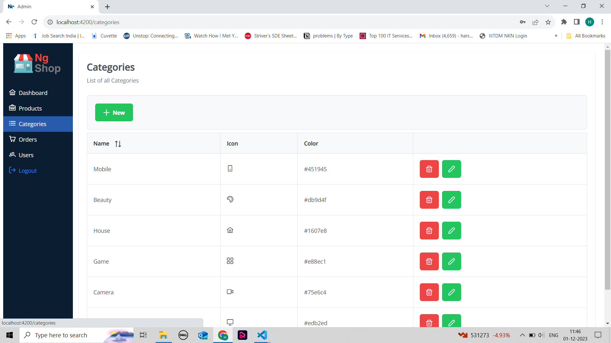
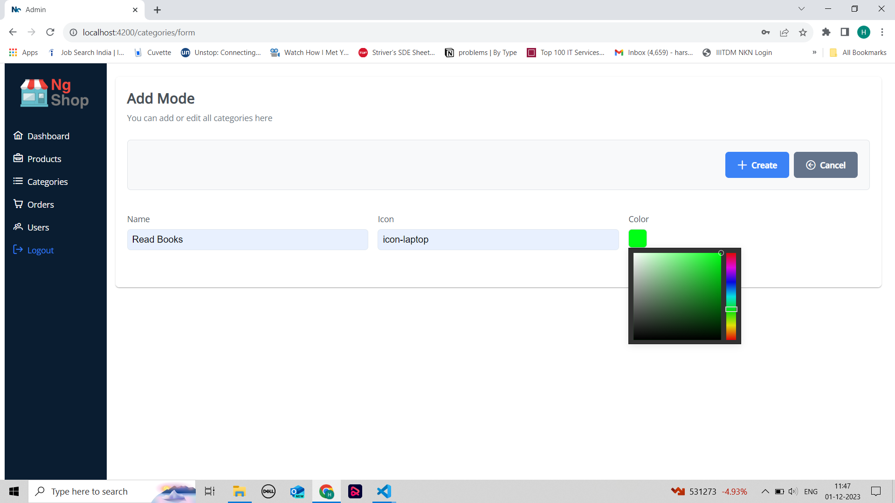
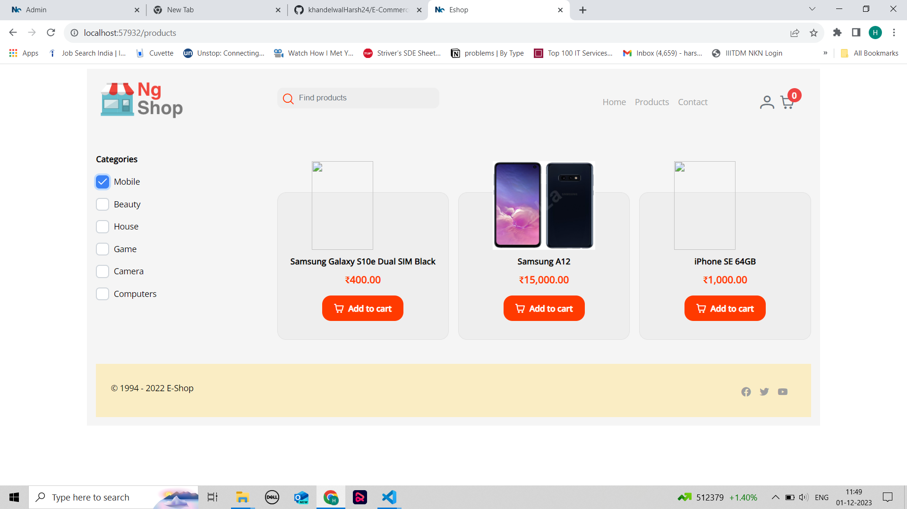
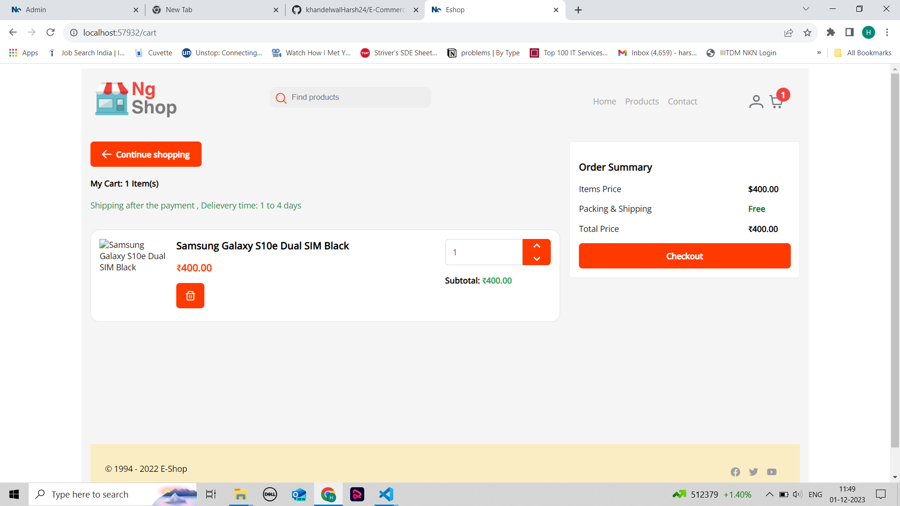

# E-Commerce_FullStack

### Screenshots

### Admin Page

## Login

## Dashboard

## Product List

## Edit Page

## Order List

## User List

## Category List

### User Page

## Dashboard Page

## Product List

;

## Product Filter on Category

## Checkout Cart Page

## Book Item Form

## Order Placed Page

